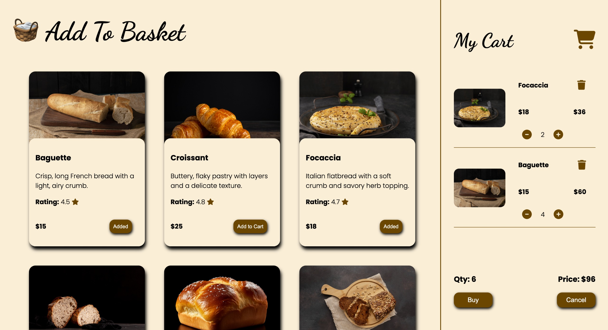

# Add To Basket

Add to Basket is a React-based cart application designed to practice and implement essential cart functionalities. This project focuses on key features such as adding, deleting, and updating items within the cart. It provides hands-on experience with managing state and user interactions in a React application.

## To Visit <a href="https://kumarharsh13.github.io/add-to-basket/" target="_blank">Click Here</a>

## ScreenShot

